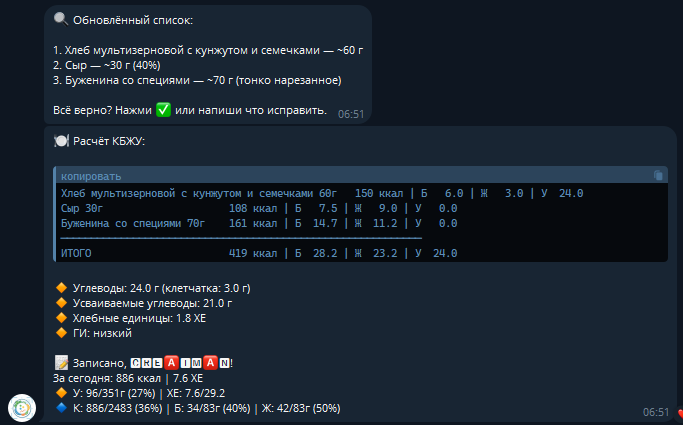
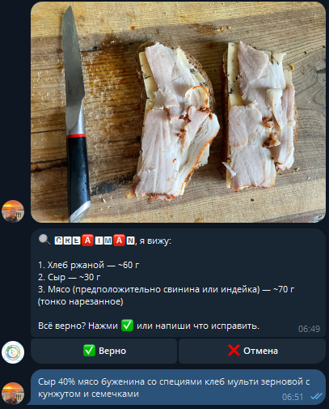
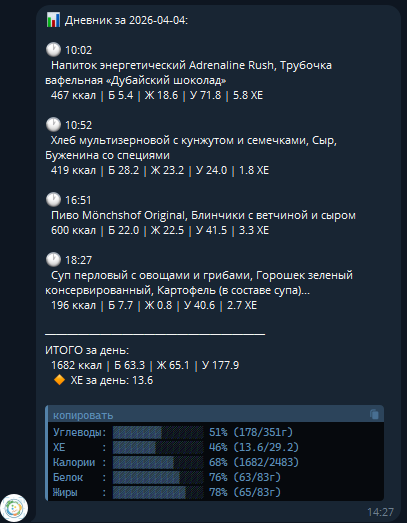
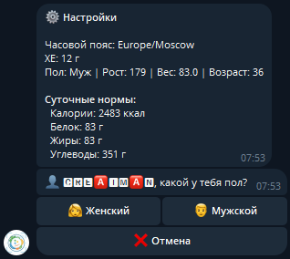
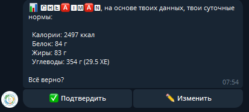
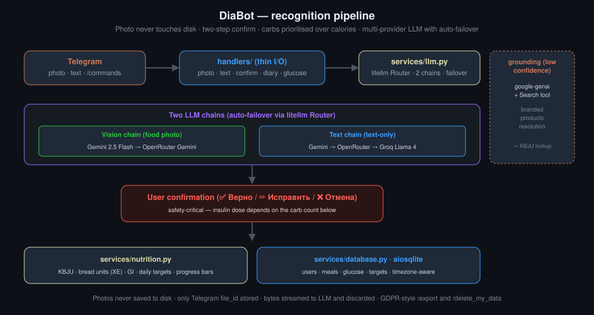

# 🍽 DiaBot — некоммерческий AI-ассистент по питанию для диабета 1 типа

[](LICENSE)
[](https://github.com/CreatmanCEO/diabot/stargazers)
[](https://github.com/CreatmanCEO/diabot/actions/workflows/validate.yml)
[](#статус--только-некоммерческое-использование)
[](https://www.python.org/downloads/)
[](https://core.telegram.org/bots/api)

🇷🇺 Русский · [🇬🇧 English](README.md)

**Open-source некоммерческий Telegram-бот для людей с диабетом 1 типа. Сделан для близких и друзей разработчиком, у которого диабет в семье — открыт для сообщества. Активная разработка — приветствуются контрибьюторы на условиях некоммерческого использования.**

---

## Зачем это существует

Каждый приём пищи для человека с диабетом 1 типа — математическая задача. Оценить углеводы в тарелке, перевести в хлебные единицы, рассчитать дозу инсулина. Ошибка в 1–2 ХЕ — гипогликемия или гипергликемия: госпитализация, потеря сознания, кома. Это делается 4–6 раз в день, каждый день, всю жизнь.

DiaBot превращает подсчёт углеводов в одно действие: **сфотографируй еду — получи результат.** AI распознаёт продукты, пользователь подтверждает или поправляет, бот считает КБЖУ и хлебные единицы, ведёт дневник, показывает прогресс к дневным целям. Углеводы и ХЕ всегда впереди — потому что от них зависит доза инсулина.

## Статус — только некоммерческое использование

Проект в **активной разработке** и распространяется по [PolyForm Noncommercial 1.0.0](https://polyformproject.org/licenses/noncommercial/1.0.0). Можно поднимать для себя, семьи, круга друзей. **Коммерческое использование — включая хостинг как платный сервис или встраивание в коммерческий продукт — не разрешено.** Контрибьюторы приветствуются на тех же условиях.

Бот нуждается в помощи: более жёсткое промптирование LLM, точнее диетологические расчёты, верификация ответов перед пользователем, интеграция с внешними базами КБЖУ (USDA, OpenFoodFacts, региональные), региональная адаптация. Подробности в [Дорожная карта и ограничения](#дорожная-карта-и-ограничения) и [`CONTRIBUTING.md`](CONTRIBUTING.md).

## Как это выглядит

> Интерфейс показан на русском (язык по умолчанию). Английская локаль также полностью поддерживается — выбирается автоматически по настройкам Telegram.

<table>
  <tr>
    <td colspan="2" align="center"></td>
  </tr>
  <tr>
    <td colspan="2" align="center"><b>Финальный результат — таблица КБЖУ + прогресс дня</b><br><sub>Весь цикл на одном экране: КБЖУ по позициям, итоги, отдельно углеводы / усваиваемые / ХЕ / ГИ, и прогресс-бары к дневным целям.</sub></td>
  </tr>
  <tr>
    <td align="center"></td>
    <td align="center"></td>
  </tr>
  <tr>
    <td align="center"><b>Распознавание фото</b><br><sub>Отправил фото — vision-LLM назвал продукты и оценил порции в граммах. Двухшаговое подтверждение — это safety-механизм: пользователь имеет последнее слово до того, как доза инсулина считается на эти числа.</sub></td>
    <td align="center"><b>Дневник</b><br><sub><code>/today</code> — каждый приём с временем и КБЖУ, плюс прогресс-бары. <code>/week</code> — недельная агрегация. <code>/history N</code> — глубже.</sub></td>
  </tr>
  <tr>
    <td align="center"></td>
    <td align="center"></td>
  </tr>
  <tr>
    <td align="center"><b>Onboarding</b><br><sub>Пять шагов: согласие → пол → рост → вес → возраст → цели. Нормы КБЖУ автосчитаются по Mifflin-St Jeor; ручной override — один тап, если диетолог прописал другое.</sub></td>
    <td align="center"><b>Подтверждение профиля</b><br><sub>Финальный обзор перед IDLE. Все данные хранятся локально в SQLite; видны через <code>/export</code>; удаляются через <code>/delete_my_data</code>.</sub></td>
  </tr>
</table>

## Архитектура



| Слой | Технология | Заметки |
|---|---|---|
| Язык | Python 3.11+, полностью async | один event loop, без thread pools |
| Telegram | `python-telegram-bot` 21+ | polling, `ConversationHandler` для состояний |
| LLM router | `litellm` Router с двумя цепочками | vision (Gemini 2.5 Flash → OpenRouter Gemini) + text (Gemini → OpenRouter → Groq Llama 4) |
| Search grounding | `google-genai` | Google Search tool — fallback для брендов с низкой уверенностью |
| База | SQLite через `aiosqlite` | без ORM, plain SQL, схема в одном файле |
| Конфиг | `python-dotenv` | frozen `Settings` dataclass валидируется при старте |
| Деплой | systemd unit включён | работает под отдельным пользователем в `/opt/diabot/` |
| Тесты | 72 pytest-кейса | покрывают каждый handler и сервис |

## Как это работает

1. **Отправь фото** еды (или опиши текстом)
2. **Бот распознаёт** продукты и порции через vision-LLM
3. **Подтверди или поправь** — бот покажет что увидел, ты корректируешь при необходимости
4. **Получи КБЖУ + ХЕ** — расчёт с углеводами на первом месте
5. **Следи за прогрессом** — дневник, недельная статистика, прогресс-бары к дневным целям

## Ключевые возможности

**Распознавание еды**
- 📷 Фото → AI распознаёт продукты и порции
- ✏️ Текстовое описание (без фото)
- 📷+✏️ Фото с подписью для уточнения
- 🏷 Распознавание брендов с Google Search grounding для редких марок

**Точный подсчёт**
- 🔢 Калории, белки, жиры, углеводы (КБЖУ)
- 🍞 Хлебные единицы (ХЕ) — настраиваемый коэффициент (по умолчанию 1 ХЕ = 12 г углеводов)
- 🎯 Углеводы всегда первыми — приоритет дозирования инсулина
- ✅ Двухшаговый flow: распознал → подтвердил → сохранил

**Дневные цели и прогресс**
- 👤 Профиль: пол, рост, вес, возраст
- 📊 Авто-расчёт норм по Mifflin-St Jeor
- ✍️ Ручной override (для рекомендаций диетолога)
- 📈 Компактный прогресс после каждого приёма
- ▓▓▓░░░ Визуальные прогресс-бары в дневнике

**Дневник питания**
- 📅 Сегодня по приёмам (`/today`)
- 📊 Недельная статистика (`/week`)
- 📜 История (`/history N`)
- ↩️ Отмена последней записи (`/undo`)
- 🩸 Глюкоза (`/sugar`)

**Конфиденциальность**
- 🔒 Согласие на старте с описанием обработки
- 🚫 Фото НИКОГДА не сохраняются на диск (только Telegram `file_id`)
- 📦 Полный экспорт (`/export` как JSON)
- 🗑 Полное удаление (`/delete_my_data`)
- ✅ GDPR-совместимость

**Мультипользовательский режим**
- 👥 Self-hosted с системой одобрения
- 📩 Пользователь запрашивает → админ получает уведомление → пользователь получает ответ
- ⚡ Per-user rate limiting

## Дорожная карта и ограничения

> **Disclaimer по безопасности.** Это инструмент-помощник, **не медицинское устройство**. Всегда перепроверяй критичные значения углеводов перед дозированием инсулина. Двухшаговый flow «распознал → подтвердил» — это safety-механизм, не косметика, не пропускай его. Не замена эндокринолога / диетолога.

### Активные направления (нужны контрибьюторы)

- **Жёсткое промптирование LLM** — строже JSON-schema валидация, ниже температура, детерминированная оценка порций
- **Точные диетологические расчёты** — верифицированная эвристика порций, гликемическая нагрузка, вычитание клетчатки в усваиваемых углеводах
- **Верификация ответов перед пользователем** — confidence scores на позицию, явный «double-check» флаг при низкой уверенности
- **Внешние базы КБЖУ** — [USDA FoodData Central](https://fdc.nal.usda.gov/), [OpenFoodFacts](https://world.openfoodfacts.org/), региональные русские / восточно-европейские источники
- **Региональная адаптивность** — EU / US / RU / Asia нормы и кухни, бренды, локальные блюда

### Текущие ограничения

- LLM может ошибаться (плохое освещение, мелкие порции, региональные блюда, необычные ракурсы). Двухшаговое подтверждение существует именно поэтому.
- Интеграции с CGM пока нет
- Билингв-промпты протестированы в основном на RU; верификация EN-локали в процессе
- Google Search grounding доступен только в Gemini-цепочке — OpenRouter / Groq fallbacks пока не поддерживают
- Onboarding принимает метрики только в метрической системе — imperial-перевод в backlog'е

## Быстрый старт

```bash
git clone https://github.com/CreatmanCEO/diabot.git
cd diabot
python -m venv venv
source venv/bin/activate              # Linux / macOS — на Windows: venv\Scripts\activate
pip install -r requirements.txt
cp .env.example .env
# Заполни API-ключи в .env
python main.py
```

### Переменные окружения

| Переменная | Описание | Обязательно |
|---|---|:---:|
| `TELEGRAM_TOKEN` | Токен от @BotFather | да |
| `ADMIN_IDS` | Через запятую Telegram ID админов | да |
| `GEMINI_API_KEY` | API ключ Google AI Studio | * |
| `OPENROUTER_API_KEY` | API ключ OpenRouter | * |
| `GROQ_API_KEY` | API ключ Groq | * |
| `DEFAULT_TIMEZONE` | Часовой пояс (`Europe/Moscow`) | нет |
| `DEFAULT_HE_GRAMS` | Граммов углеводов в 1 ХЕ (`12`) | нет |
| `DEFAULT_LANGUAGE` | Язык по умолчанию (`ru`) | нет |
| `RATE_LIMIT_REQUESTS` | Per-user лимит в час (`30`) | нет |
| `DB_PATH` | Путь к SQLite | нет |

\* Нужен хотя бы один LLM-ключ. Распознавание фото требует `GEMINI_API_KEY` или `OPENROUTER_API_KEY`.

### Деплой (systemd)

```bash
sudo useradd -r -s /bin/false diabot
sudo mkdir -p /opt/diabot
sudo git clone https://github.com/CreatmanCEO/diabot.git /opt/diabot
cd /opt/diabot
sudo python3 -m venv venv
sudo venv/bin/pip install -r requirements.txt
sudo cp .env.example .env
sudo nano .env                                # заполни токены
sudo cp diabot.service /etc/systemd/system/
sudo systemctl daemon-reload
sudo systemctl enable diabot
sudo systemctl start diabot
```

## Структура

```
diabot/
├── main.py                     # Entry point, ConversationHandler
├── config.py                   # Settings из .env (frozen, validated)
├── handlers/                   # Telegram-обёртки (тонкий I/O)
│   ├── start.py                # /start, onboarding, /help
│   ├── photo.py                # Pipeline распознавания фото
│   ├── text.py                 # Текстовый ввод + reply keyboard
│   ├── confirm.py              # Подтверждение / коррекция / отмена
│   ├── diary.py                # /today, /week, /history, /undo
│   ├── glucose.py              # /sugar
│   ├── settings.py             # Профиль / цели / админ-панель
│   ├── admin.py                # /adduser, /removeuser, /listusers
│   ├── privacy.py              # /privacy, /export, /delete_my_data
│   └── keyboards.py            # Фабрика клавиатур
├── services/                   # Бизнес-логика (без Telegram)
│   ├── llm.py                  # litellm Router, две цепочки
│   ├── nutrition.py            # КБЖУ, прогресс-бары, ХЕ
│   ├── database.py             # aiosqlite CRUD
│   └── auth.py                 # Доступ, rate limiting, очередь одобрения
├── models/schemas.py           # Dataclasses
├── locales/                    # i18n + LLM-промпты
│   ├── ru.py                   # Русский (по умолчанию)
│   └── en.py                   # Английский
├── docs/
│   ├── architecture.svg        # Pipeline-диаграмма этого README
│   ├── plans/                  # Design-документы и планы
│   └── screenshots/            # Ассеты README
├── tests/                      # 72 теста pytest
├── diabot.service              # systemd unit
├── CHANGELOG.md
├── CONTRIBUTING.md
├── CLAUDE.md                   # Конституция Claude Code
└── LICENSE                     # PolyForm Noncommercial 1.0.0
```

## State machine

```
ONBOARDING: согласие → пол → рост → вес → возраст → цели → IDLE
IDLE ↔ AWAITING_CONFIRM   (распознавание еды)
IDLE ↔ AWAITING_GLUCOSE    (запись глюкозы)
```

## Архитектурные решения

- **Handlers тонкие** — вся логика в `services/`, handlers только Telegram-I/O
- **Две LLM-цепочки** — vision (Gemini → OpenRouter) для фото; text (Gemini → OpenRouter → Groq Llama 4) для описаний. `litellm` Router делает auto-failover.
- **Google Search grounding** — при низкой уверенности на брендах отдельный `google-genai` запрос с Search-инструментом достаёт точные КБЖУ.
- **Точность углеводов > точности калорий** — отражено в промптах, форматировании, порядке UI. Дозирование инсулина зависит от углеводов.
- **Без ORM** — plain SQL через `aiosqlite`. Схема в одном файле; ORM добавил бы сложность без пользы.
- **Фото не пишутся на диск** — только Telegram `file_id`. Байты подгружаются по запросу и передаются прямо в LLM.
- **Двухшаговое подтверждение — safety-механизм** — распознал → подтвердил. Без явного подтверждения приём не сохраняется и расчёт инсулина не подразумевается.

## Работа над проектом

Сконфигурирован под [Claude Code](https://code.claude.com) как primary драйвер — см. [`CLAUDE.md`](CLAUDE.md). Тот же автор поддерживает [Claude Code Anti-Regression Setup](https://github.com/CreatmanCEO/claude-code-antiregression-setup) — этот паттерн держит 72-test-suite зелёным во время рефакторингов.

Тесты:

```bash
python -m pytest tests/ -v
```

Per-iteration design-документы в `docs/plans/`. Новая работа стартует с design-доком, потом код.

## Контрибьют

PR приветствуются на тех же некоммерческих условиях. См. [`CONTRIBUTING.md`](CONTRIBUTING.md) — приоритеты: ужесточение LLM-промптов, диетологическая точность, верификация ответов, внешние базы КБЖУ, региональная адаптивность, нативные локализации помимо RU/EN.

## Связанные проекты

- [Claude Code Anti-Regression Setup](https://github.com/CreatmanCEO/claude-code-antiregression-setup) — sister-репо того же автора. `.claude/` config + субагенты + хуки, держат 72-test-suite зелёным.
- [ai-context-hierarchy](https://github.com/CreatmanCEO/ai-context-hierarchy) — sister-репо. Трёхуровневая система контекста, которой пользуется Claude Code на этом проекте.
- [claude-statusline](https://github.com/CreatmanCEO/claude-statusline) — sister-репо. Statusline для Claude Code с VPS-мониторингом.
- [lingua-companion](https://github.com/CreatmanCEO/lingua-companion) — другой продукт того же автора — voice-first English tutor для русскоговорящих IT-специалистов. Другой домен, та же инженерная дисциплина.

## Автор

**Николай Подоляк (Nick Podolyak)** — Python-разработчик и цифровой архитектор в [CREATMAN](https://creatman.site)

- GitHub: [@CreatmanCEO](https://github.com/CreatmanCEO)
- Habr: [creatman](https://habr.com/ru/users/creatman/)
- dev.to: [@creatman](https://dev.to/creatman)

## Лицензия

[PolyForm Noncommercial 1.0.0](LICENSE) · Николай Подоляк. Только некоммерческое использование — см. [Статус](#статус--только-некоммерческое-использование).
